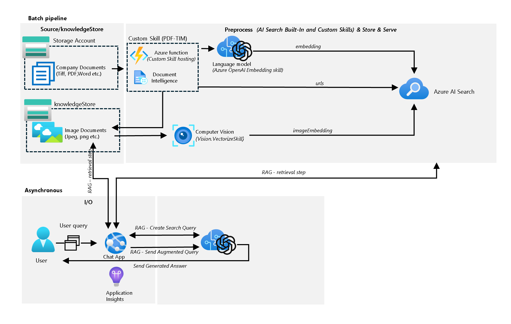
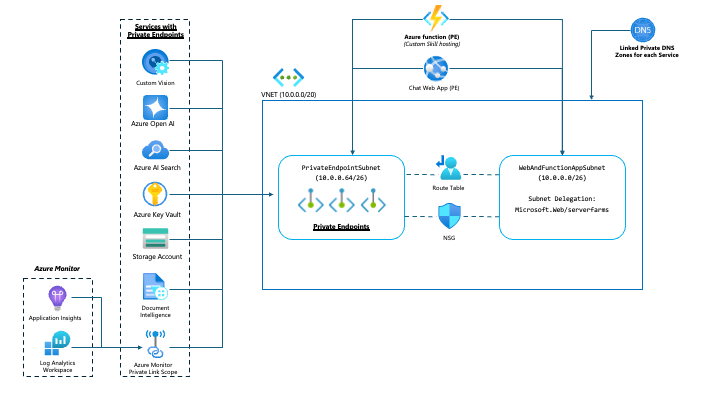

# Multimodal AI

## Table of Contents

- [Multimodal AI](#multimodal-ai)
  - [Table of Contents](#table-of-contents)
  - [Overview](#overview)
  - [About this project](#about-this-project)
  - [What's included](#whats-included)
  - [High-level architecture](#high-level-architecture)
  - [Azure services required](#azure-services-required)
  - [Deployment](#deployment)
  - [References](#references)
    - [Sample documents](#sample-documents)
  - [Contributing](#contributing)
  - [Trademarks](#trademarks)

## Overview

Welcome to the Multimodal AI project!

The goal of the Multimodal AI project is to provide an enterprise-ready solution for customers looking to infuse Generative AI (Gen AI) into their existing applications, or create brand-new applications, that go beyond processing text-based content only. This project leverages the latest advancements in multimodal AI, to implement generative AI solutions such as Retrieval Augmented Generation (RAG), image classification or video analysis, for content based on text, images, audio and video. For images, the goal is to go beyond traditional Object Character Recognition (OCR) and generate embeddings on the actual image content

## About this project

This project has been created and is maintained by the Strategic Workload Acceleration Team (SWAT) at Microsoft and we aim to provide enterprise-ready GenAI solutions regardless of whether the data is in text, image, audio or video format.

With the rapid development and introduction of new multimodal AI models, such as [GPT-4o](https://openai.com/index/hello-gpt-4o/), customers are realizing the value of implementing GenAI solutions that go beyond simply using text-based documents within their organizations and instead, they are looking for solutions that leverage other media types that are in use within their organizations, for example, categorize a video and find specific scenes or analyse documents with images embedded that include architectural diagrams or flow charts to provide better answers to users.

This project aims to provide a GenAI solution that enables customers to interact with their data across various formats—including text, text with images, images, audio, and video using native Azure PaaS services. Through this solution, data can be processed server-side on Azure for activities like chunking, generating images from files, creating embeddings, indexing content, extracting transcripts from videos, and identifying key scenes in videos, among other multimodal AI tasks. This architecture ensures an enterprise-grade, highly scalable solution that can grow with business demands by leveraging Azure's power and scalability, without reliance on client-side processing or local developer workstations.

## What's included
In the current release, the Multimodal AI project includes:

- A RAG solution using Azure AI Services that allow users to interact with data contained in text and images (for example, charts or diagrams).
- The entire solution is deployed using a secure-by-default architecture, where:
   - Azure services are deployed with public endpoints disabled.
   - Communication to and between Azure services is done via private endpoints and VNet network integration options.
   - Service-to-service authentication via Entra-Id.
   - No local authentication.
- Bring-your-own VNet capabilities (so that you can integrate this solution into your existing environment).
   - We provide an optional Azure pre-requisites deployment experience in case you don't have an existing VNet or Azure DNS Private Zones (for private link).
- A web client (see [references](#references)) that users can interact with to submit prompts, get results and visualize the citations.
   - Authentication via Entra Id can be configured during the initial deployment or afterwards.
- Reference implementations in Terraform.
   - Bicep implementation is currently work in progress and not available for usage just yet, but it will be available in subsequent releases.
- Simple deployment experiences via GitHub actions or via Terraform and  with a minimal set of prerequistes.
- Data processing activities (like chunking, generating embeddings, converting documents to images, etc.) are executed server-side on Azure via Azure AI Search (using built-in capabilities as well as using custom skills).
- Usage of AI Search [data sources](https://learn.microsoft.com/en-us/AZURE/search/search-data-sources-gallery) for easier processing and ingestion of documents by simply uploading the documents, images, videos, etc. to Azure Storage (blob).
   - In this release only PDF file types are supported.
- Multimodal embeddings generated by using [AI Search integrated vectorization](https://learn.microsoft.com/en-us/azure/search/vector-search-integrated-vectorization):
   - Images: Azure AI Vision multimodal embeddings skill (in preview): https://learn.microsoft.com/en-us/azure/search/cognitive-search-skill-vision-vectorize
   - Text: Azure OpenAI Embedding skill : https://learn.microsoft.com/en-us/azure/search/cognitive-search-skill-azure-openai-embedding
- Image generation from PDF files as part of the AI Search indexing process by using an Indexer.
- Usage of Azure AI Search [custom skills](https://learn.microsoft.com/en-us/azure/search/cognitive-search-custom-skill-interface) (for activities like interacting with Azure Document Intelligence).
- Leverage AI Search [knowledge storage](https://learn.microsoft.com/en-us/azure/search/knowledge-store-concept-intro) to persist images generated as part of the indexing process.

Please note that additional capabilities, including support for audio and video content, compatibility with other file types are on the roadmap and will be incorporated in future releases.

## High-level architecture

The following picture depicts the high-level architecture of the Multimodal AI Project:

And the following picture depicts the high-level design of the Multimodal AI Project, where you can visualize the different Azure resources deployed as well as the network integration options:

## Azure services required

As the architectural and design diagram in the previous section depict, this project deploys and configures the following Azure resources:
- Azure OpenAI with the following models
   - gpt-4o
   - gpt-35-turbo
   - text-embedding-ada-002
- Azure AI Search with the following features configured
   - Data sources
   - Indexes
   - Built-in skills
   - Custom skills
   - Indexer
   - Knowledge store
- Azure AI Services multi-service account
   - Used by AI Search for billing purposes
- Document Intelligence
   - To extract text from documents
- Azure AI Vision (Computer Vision)
   - For generating embeddings of images
- Azure Functions
   - For hosting AI Search custom skills
- Azure App Service
   - For the web application
- Azure Entra Id
   - For authenticating users accesing the web application
- Azure Log Analytics Workspace
- Azure Application Insights
- Azure Monitor Private Link Scope (AMPLS) for private access to Log Analytics Workspace and Application Insights.
- Storage Account
   - To provide the documents to be indexed
   - To host the knowledgestore storing the created/extracted images

## Limitations
Before determining your deployment topology (e.g. where to deploy services), be aware of following restrictions.

- Open AI Service Location: This is the location where the OpenAI service is deployed. This must be a region that supports gpt-35-turbo,0125 models for OpenAI. Valid values at the time this code published are:
  - australiaeast
  - canadaeast
  - eastus
  - eastus2  
  - japaneast
  - northcentralus
  - southcentralus
  - southindia  
  - switzerlandnorth
  - uksouth
  - westus
  - westus3

  Regions that support gpt-35-turbo,0125 models are published [here](https://learn.microsoft.com/en-us/azure/ai-services/openai/concepts/models#gpt-35-models)

- Form Recognizer / Document Intelligence Service Location: This is the location where the Form Recognizer cognitive service is deployed. This must be a region that supports API 2024-07-31-preview. Valid values at the time this code published are:
  - eastus
  - northcentralus
  - westeurope
  - westus2

  Regions that support API 2024-07-31-preview are published [here](https://learn.microsoft.com/en-us/azure/cognitive-services/form-recognizer/overview#supported-apis)

- Computer Vision Service Location : This is the location where the Form Recognizer cognitive service is deployed. This must be a region that supports Multimodal embeddings. Valid values at the time this code published are:
  - eastus
  - westus
  - westus2
  - francecentral
  - northeurope
  - westeurope
  - swedencentral
  - switzerlandnorth
  - australiaeast
  - southeastasia
  - koreacentral
  - japaneast

  Regions that support Multimodal embeddings are published [here](https://learn.microsoft.com/en-us/azure/ai-services/computer-vision/overview-image-analysis?tabs=4-0#region-availability)

## Deployment

This project is designed to streamline enterprise deployment through CI/CD tooling and pipelines while also allowing easy deployment from developer workstations for evaluation purposes. Currently, we only support deployments based on Terraform, but support for Bicep is in our roadmap.

- [Terraform](/deployment/terraform/)
- Bicep (available in future releases)

## References

This project leverages the [ChatGPT-like app with your data using Azure OpenAI and Azure AI Search](https://github.com/Azure-Samples/azure-search-openai-demo) Open Source project by using its web application used by users to submit prompts and get responses from a Large Language Model (LLM) such as Azure OpenAI GPT4o as well as  some of its Python scripts such as: 

- Logic to parse documents with Document Intelligence.
- Logic to parse documents across pages.
- The backend API.

### Sample documents

If you're evaluating this solution and you would like to use some sample documents with mix of text, tables and images, feel free to use some of the sample documents from these GitHub repositories:

- [Azure Search Sample Data](https://github.com/Azure-Samples/azure-search-sample-data)
- [Azure Search Vector Samples](https://github.com/Azure/azure-search-vector-samples)
- [Azure Search OpenAI Demo](https://github.com/Azure-Samples/azure-search-openai-demo)

## Contributing

This project welcomes contributions and suggestions.  Most contributions require you to agree to a
Contributor License Agreement (CLA) declaring that you have the right to, and actually do, grant us
the rights to use your contribution. For details, visit https://cla.opensource.microsoft.com.

When you submit a pull request, a CLA bot will automatically determine whether you need to provide
a CLA and decorate the PR appropriately (e.g., status check, comment). Simply follow the instructions
provided by the bot. You will only need to do this once across all repos using our CLA.

This project has adopted the [Microsoft Open Source Code of Conduct](https://opensource.microsoft.com/codeofconduct/).
For more information see the [Code of Conduct FAQ](https://opensource.microsoft.com/codeofconduct/faq/) or
contact [opencode@microsoft.com](mailto:opencode@microsoft.com) with any additional questions or comments.

## Trademarks

This project may contain trademarks or logos for projects, products, or services. Authorized use of Microsoft 
trademarks or logos is subject to and must follow 
[Microsoft's Trademark & Brand Guidelines](https://www.microsoft.com/en-us/legal/intellectualproperty/trademarks/usage/general).
Use of Microsoft trademarks or logos in modified versions of this project must not cause confusion or imply Microsoft sponsorship.
Any use of third-party trademarks or logos are subject to those third-party's policies.
