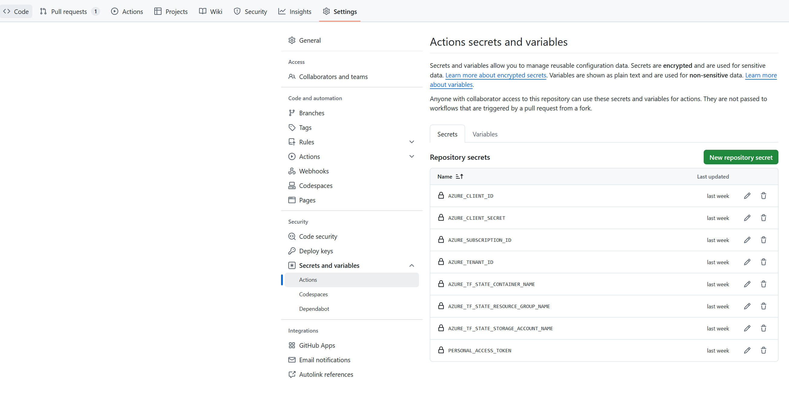
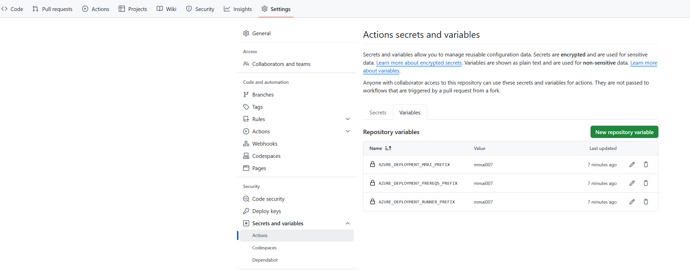
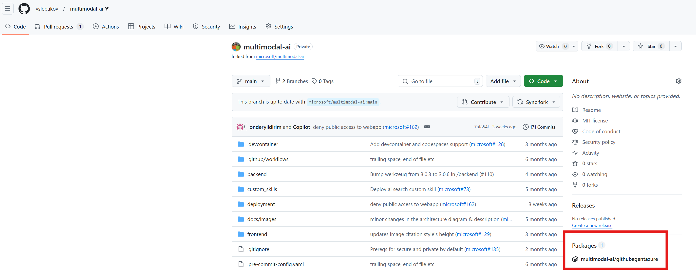
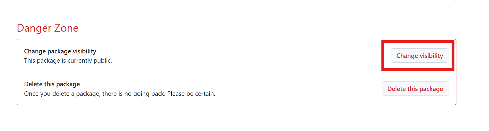

# Deploying Multimodal AI Platform Using Terraform and GitHub Actions

## Overview

The **Multimodal AI Platform** leverages Terraform and GitHub Actions to deploy a robust, containerized infrastructure on Azure. The deployment includes:
- A self-hosted GitHub runner for CI/CD.
- Azure Container Apps hosting the runner.
- Prerequisites such as virtual networks and private DNS zones.
- Complete infrastructure for the MMAI platform.

This README provides step-by-step instructions for configuring your environment, deploying the platform, and troubleshooting common issues.

## Table of Contents

- [Overview](#overview)
- [Prerequisites](#prerequisites)
  - [Repository Fork](#repository-fork)
  - [Azure Setup](#azure-setup)
  - [GitHub Setup](#github-setup)
- [Workflows](#workflows)
- [Usage](#usage)
  - [Quick Start: Deploy Everything](#quick-start-deploy-everything)
  - [Sample Usage Scenario](#sample-usage-scenario)
- [Known Issues & Troubleshooting](#known-issues--troubleshooting)

---

## Prerequisites

Before deploying, ensure you have configured the following:

### Repository Fork

- **Fork the Repository:**
  Fork the `microsoft/multimodal-ai` repository to your own GitHub account.

### Azure Setup

1. **Create a Service Principal:**
   Run the following command and save the output values (`appId`, `password`, `tenant`):
   ```bash
   az ad sp create-for-rbac --name <NAME_OF_THE_SP> --role owner --scopes /subscriptions/<SUBSCRIPTION_ID>
   ```
   > **Important Note:**
   > This command will also grant the "Owner" role to this Service Principal at the subscription level.

   In case you want to deploy MMAI with authentication enabled, you will also need to grant this Service Principal the [Application Administrator](https://learn.microsoft.com/en-us/entra/identity/role-based-access-control/permissions-reference?utm_source=chatgpt.com#application-administrator) or [Cloud Application Administrator](https://learn.microsoft.com/en-us/entra/identity/role-based-access-control/permissions-reference?utm_source=chatgpt.com#cloud-application-administrator) [privileged](https://learn.microsoft.com/en-us/entra/identity/role-based-access-control/privileged-roles-permissions?tabs=admin-center#which-roles-and-permissions-are-privileged) role in Microsoft Entra ID.

2. **Create Storage Account & Blob Container:**

   - Create an Azure Storage Account.
   - Create a Blob Container to store your Terraform state.
   - Assign the **Storage Blob Data Contributor** role to the Service Principal.

### GitHub Setup

1. **Personal Access Token (PAT):**
   Create a GitHub PAT for authenticating the self-hosted runner. Follow [these instructions](https://learn.microsoft.com/en-us/azure/container-apps/tutorial-ci-cd-runners-jobs?pivots=container-apps-jobs-self-hosted-ci-cd-github-actions&tabs=bash#get-a-github-personal-access-token).

2. **Configure Repository Secrets:**
   Navigate to **Settings** → **Secrets and variables** → **Actions** and create the following secrets:

   | Secret Name                             | Description                                               |
   | --------------------------------------- | --------------------------------------------------------- |
   | `AZURE_CLIENT_ID`                       | Client Id of the Service Principal                        |
   | `AZURE_CLIENT_SECRET`                   | Client Secret of the Service Principal                    |
   | `AZURE_SUBSCRIPTION_ID`                 | Azure Subscription to deploy to                           |
   | `AZURE_TENANT_ID`                       | Azure Tenant for deployment                               |
   | `AZURE_TF_STATE_CONTAINER_NAME`         | Blob container name for Terraform state                   |
   | `AZURE_TF_STATE_RESOURCE_GROUP_NAME`    | Resource Group containing the storage account             |
   | `AZURE_TF_STATE_STORAGE_ACCOUNT_NAME`   | Azure Storage account name                                |
   | `PERSONAL_ACCESS_TOKEN`                 | GitHub PAT for the self-hosted runner authentication      |

   

3. **Configure Repository Variables:**
   Navigate to **Settings** → **Secrets and variables** → **Actions** and create the following variables:

   | Variable Name                           | Description                                                |
   | --------------------------------------- | -----------------------------------------------------------|
   | `AZURE_DEPLOYMENT_PREREQS_PREFIX`       | Prefix to use for the Prereqs Resource Group and Resources |
   | `AZURE_DEPLOYMENT_MMAI_PREFIX`          | Prefix to use for the MMAI Resource Group and Resources    |
   | `AZURE_DEPLOYMENT_RUNNER_PREFIX`        | Prefix to use for the Runner Resource Group and Resources  |

   
---

## Workflows

The project includes several GitHub Actions workflows:

- **GitHub Build Agent (Runner) Deployment (`terraformBuildAgent.yml`)**
  - **What it does:**
    - Builds and pushes the Docker container image for the self-hosted GitHub runner.
    - Deploys prerequisites (e.g., virtual networks, private DNS zones).
    - Deploys the Azure Container App for the runner.
  - **Trigger:** Manual execution.

- **MMAI Deployment (`terraformMMAI.yml`)**
  - **What it does:**
    - Deploys prerequisites (e.g., virtual networks, private DNS zones).
    - Deploys the MMAI infrastructure.
  - **Trigger:** Manual execution or pull request events.

- **Build & Push Docker Container (`container.yml`)**
  - **What it does:**
    - Builds and pushes the Docker container image for the self-hosted GitHub runner.
  - **Trigger:** Manual execution or pull request events.

---

## Usage

### Quick Start: Deploy Everything

If starting with a freshly forked repository, run the **GitHub Build Agent (Runner) Deployment (`terraformBuildAgent.yml`)** workflow manually. This will deploy the private self-hosted CI/CD system. Once this process completes, manually trigger the deplyoment workflow **MMAI Deployment (`terraformMMAI.yml`)** to deploy the MMAI infrastructure and code.

> **Important Note:**
> In a private repository, GitHub Packages (such as the GitHub runner container image) may not be accessible by default.
> To resolve this:
> 1. After building the container image, locate it in the repository’s **Packages** section.
> 2. Click on the package name, navigate to **Package settings**, and change its visibility to **public**.

> 
> 
> Refer to [GitHub Packages access control](https://docs.github.com/en/packages/learn-github-packages/configuring-a-packages-access-control-and-visibility#configuring-access-to-packages-for-your-personal-account).

### Sample Usage Scenario

1. **Fork the Repository.**
2. **Configure Prerequisites (Azure and GitHub).**
3. **Deploy the Build System:** Run the **GitHub Build Agent (Runner) Deployment (`terraformBuildAgent.yml`)** workflow manually.
4. **Deploy MMAI:** Run the **MMAI Deployment (`terraformMMAI.yml`)** workflow manually.
5. **Develop & Test:**
   - Create a new branch.
   - Implement new features or fix bugs.
   - Submit a pull request to either the original repository or your fork’s main branch.
6. **Automatic Deployment:**
   The **MMAI Deployment (`terraformMMAI.yml`)** workflow triggers automatically for:
   - Terraform template changes.
   - Backend/frontend updates.
   - Workflow configuration updates.
7. **Validate & Iterate:**
   - Test the deployed platform.
   - Re-run workflows for additional changes if necessary.
8. **Merge PR.**
---

## Known Issues & Troubleshooting

- **GitHub Runner Job Pickup Issue:**
  There is a known issue where the GitHub runner connects to GitHub but does not pick up jobs if the job is queued before the runner starts.
  - **Workaround:**
    - If an idle runner is present with pending jobs, cancel the job and manually restart it.
  - More details: [GitHub Community Discussion](https://github.com/orgs/community/discussions/120813).
