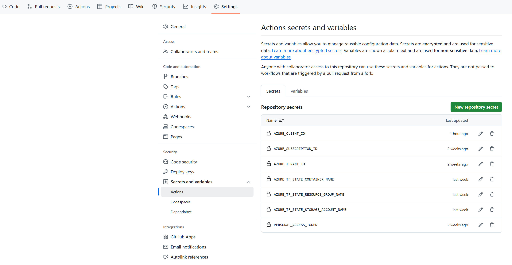

# Deploying Multimodal AI Platform Using Terraform and GitHub Actions

## Prerequisites

- Fork the microsoft/multimodal-ai repository

- Create a service principal that will be used to run the deployment:

  `az ad sp create-for-rbac --name <NAME_OF_THE_SP> --role owner --scopes /subscriptions/<SUBSCRIPTION_ID>`

  Make sure to make a note of the `appId`, `password` and `tenant` for this service principal.

- In GitHub create a personal access token (PAT) that will be used to authenticate the GitHub private runner (self-hosted build agent). Follow [these instructions](https://learn.microsoft.com/en-us/azure/container-apps/tutorial-ci-cd-runners-jobs?pivots=container-apps-jobs-self-hosted-ci-cd-github-actions&tabs=bash#get-a-github-personal-access-token) and take a note of the token.

- In Azure create a Storage account and a blob container to store terraform state. Make sure the Service Principal created has the `Storage Blob Data Contributor` role on that storage account

- In GitHub go to "Settings" -> "Secrets and variables" -> "Actions" and create following secrets:

  | `Secrets`                             |                                                            |
  | ------------------------------------- | ---------------------------------------------------------- |
  | `AZURE_CLIENT_ID`                     | Client Id of the Service Principal                         |
  | `AZURE_CLIENT_SECRET`                 | Client Secret of the Service Principal                     |
  | `AZURE_SUBSCRIPTION_ID`               | Azure Subscription to deploy to                            |
  | `AZURE_TENANT_ID`                     | Azure Tenant to deploy to                                  |
  | `AZURE_TF_STATE_CONTAINER_NAME`       | Azure Blob Storage Container name to store terraform state |
  | `AZURE_TF_STATE_RESOURCE_GROUP_NAME`  | Resource Group containing the storage account              |
  | `AZURE_TF_STATE_STORAGE_ACCOUNT_NAME` | Azure Storage account name                                 |
  | `PERSONAL_ACCESS_TOKEN`               | Personal access token for GitHub                           |

  

## Workflows

There are several GitHub workflows:

- **All Components Deployment (terraformAll.yml)**:

    - Build and push docker container image for the self-hosted GitHub runner.
    - Deploy prereqs (vnet, private DNS zones etc.)
    - Deploy Azure Container App to host self-hosted GitHub runner jobs.
    - Deploy MMAI infrastructure.

    This workflow is triggered manually.

- **MMAI Deployment (terraformMMAI.yml)**:

    - Deploy prereqs (vnet, private DNS zones etc.)
    - Deploy MMAI infrastructure.

    This workflow is triggered manually or on pull request.

- **Build & Push docker container (container.yml)**:

    -  Build and push docker container image for the self-hosted GitHub runner to the internal GitHub container registry.

## Usage

If you start with a freshly forked repo, run the **All Components Deployment (terraformAll.yml)** workflow manually to build and deploy the whole MMAI platform including the private self-hosted CI/CD system. You can always re-run this workflow as a whole or just re-run specific steps by manually selecting components to build and deploy.

> **_NOTE:_**  When working in a private repository, the packages (GitHub runner container image in our case) won't be accessible by default. In this case public access needs to be enabled so the container image can be pulled by the Azure Container Apps.
> After the container image has been built, you will see it on the repo landing page:
>
> 
>
> Click on the package name, then "Package settings" and change visibility to public:
>
> Reference [guide](https://docs.github.com/en/packages/learn-github-packages/configuring-a-packages-access-control-and-visibility#configuring-access-to-packages-for-your-personal-account).

### Sample Usage Scenario #1

1. User forks the microsoft/multimodal-ai repo
2. User configures the prerequisites
3. User runs the  **All Components Deployment (terraformAll.yml)** workflow manually to deploy everything from scratch
4. User creates a new branch and implements new features or fixes bugs
5. User creates a Pull Request to the original repo (microsoft/multimodal-ai) or the local main branch first
6. **MMAI Deployment (terraformMMAI.yml)** workflow will start automatically for
   1. Changes in terraform templates (prereqs and infra)
   2. Changes in backend and frontend
   3. Changes to the workflow itself
7. User validates that the platform is functional and fixes issues as needed triggering new workflow runs.
8. Pull request gets reviewed and merged

### Sample Usage Scenario #2

1. User forks the microsoft/multimodal-ai repo
2. User configures the prerequisites
3. User **chooses to disable** the automatic workflow execution (on pull request) for the **MMAI Deployment (terraformMMAI.yml)** workflow
4. User creates a new branch and implements new features or fixes bugs
5. User creates a Pull Request to the original repo (microsoft/multimodal-ai) or the local main branch first
6. User triggers deployment of specific component in  **All Components Deployment (terraformAll.yml)** workflow manually as needed (useful if there is no need to re-deploy the self-hosted GitHub runner).
7. User validates that the platform is functional and fixes issues as needed triggering new workflow runs.
8. Pull request gets reviewed and merged

## Known Issues

- There appears to be an [issue](https://github.com/orgs/community/discussions/120813) with the GitHub runner where it connects successfully to GitHub but does not pick up any jobs. This issue seems to arise when the job is created before a runner instance connects to GitHub. One workaround is to cancel the pending job if you see an idle runner and manually restart it so the runner picks it up.
